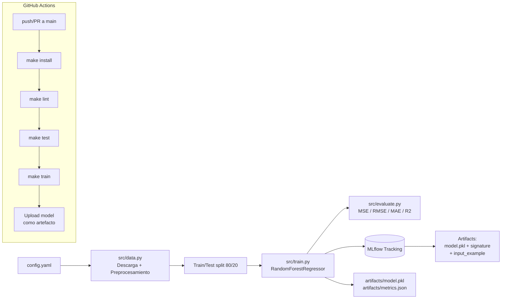

# Proyecto MLOps Entrega final

Pipeline reproducible de Machine Learning con tracking en **MLflow** y CI/CD automatizado en **GitHub Actions**. Predice el `Balance` (saldo de cuenta) de clientes bancarios a partir de sus atributos demográficos y financieros.

---

## 1. Dataset

- **Nombre**: Bank Customer Churn Modelling
- **Fuente**: Kaggle / mirrors públicos de UCI (no se usa `sklearn.datasets`).
- **Filas**: 10,000 clientes.
- **Columnas relevantes**: `CreditScore`, `Geography`, `Gender`, `Age`, `Tenure`, `NumOfProducts`, `HasCrCard`, `IsActiveMember`, `EstimatedSalary`, `Exited` y `Balance` (target).
- **Justificación**: Aunque el dataset se conoce por su tarea original de clasificación (predicción de churn), aquí lo usamos como **regresión** para predecir el saldo (`Balance`) — un problema de negocio realista que permite practicar métricas como RMSE, MAE y R² sobre datos reales con variables numéricas y categóricas.

---

## 2. Arquitectura del pipeline



---

## 3. Estructura del repositorio

```
proyecto-mlops/
├── .github/workflows/ml.yml    # Pipeline CI/CD
├── src/
│   ├── data.py                 # Carga + preprocesamiento
│   ├── evaluate.py             # Métricas de regresión
│   ├── train.py                # Script principal del pipeline
│   └── utils.py                # Helpers (config, logging)
├── tests/
│   └── test_pipeline.py        # 11 pruebas unitarias
├── data/
│   └── sample_bank_churn.csv   # Muestra sintética de respaldo (offline)
├── config.yaml                 # Hiperparámetros y rutas
├── Makefile                    # Tareas reproducibles
├── requirements.txt            # Dependencias
└── README.md
```

---

## 4. Instalación

```bash
git clone https://github.com/HelberQL/Proyecto-Final-MLOps.git

# (Opcional pero recomendado) Entorno virtual
python -m venv .venv
# Linux/Mac
source .venv/bin/activate
# Windows PowerShell
.venv\Scripts\Activate.ps1

# Instalar dependencias
pip install -r requirements.txt
# o equivalente:
make install
```

Requiere **Python 3.10+**.

---

## 5. Uso

### Comandos principales (Makefile)

| Comando | Equivalente sin make | Qué hace |
|---|---|---|
| `make install` | `pip install -r requirements.txt` | Instala dependencias |
| `make lint` | `python -m flake8 src/ tests/` | Lint con flake8 |
| `make test` | `python -m pytest tests/ -v` | Ejecuta los 11 tests |
| `make train` | `python -m src.train` | Pipeline completo (data + train + MLflow) |
| `make mlflow-ui` | `python -m mlflow ui` | UI de MLflow en `http://127.0.0.1:5000` |
| `make clean` | — | Borra `mlruns/`, `artifacts/`, cachés |

### Ejecutar el pipeline

```bash
make train
```

Salida esperada:

```
============================================================
 RESUMEN DEL ENTRENAMIENTO
============================================================
 run_id      : 9e8ade99b6b5412c833cadc635e22193
 experimento : bank-balance-regression
 features    : 11
 muestras    : train=8000 | test=2000
 Metricas TEST:
   - mse  : ...
   - rmse : ...
   - mae  : ...
   - r2   : ~0.87
============================================================
```

### Ver los runs en MLflow

```bash
make mlflow-ui
```

Abre `http://127.0.0.1:5000` y explora:

- **Experiments → bank-balance-regression** → click en el run.
- Tabs **Parameters** y **Metrics** muestran el tracking completo.
- Tab **Artifacts** muestra el modelo registrado con `signature` e `input_example`.
- En el menú lateral **Models**, aparece `BankBalanceRFRegressor` versión 1.

---

## 6. Configuración

Todos los hiperparámetros y rutas viven en **`config.yaml`**:

```yaml
data:
  url: "https://raw.githubusercontent.com/.../Bank%20Churn%20Modelling.csv"
  raw_path: "data/bank_churn.csv"
  target: "Balance"
  drop_columns: [RowNumber, CustomerId, Surname]
  categorical_columns: [Geography, Gender]

split:
  test_size: 0.2
  random_state: 42

model:
  name: "RandomForestRegressor"
  params:
    n_estimators: 200
    max_depth: 12
    min_samples_split: 5
    min_samples_leaf: 2
    random_state: 42
    n_jobs: -1

mlflow:
  experiment_name: "bank-balance-regression"
  tracking_uri: "file:./mlruns"
  registered_model_name: "BankBalanceRFRegressor"
```

Para cambiar un hiperparámetro basta con editar este archivo y volver a correr `make train`.

---

## 7. Resultados

Métricas de un run típico sobre el dataset completo (10,000 filas):

| Métrica | Train | Test |
|---|---|---|
| RMSE | ~7,984 | ~16,699 |
| MAE | ~6,245 | ~13,326 |
| R² | ~0.97 | **~0.87** |

El R² test ~0.87 indica que el modelo explica el 87% de la varianza del saldo en datos no vistos. La diferencia con train (~0.97) es el grado de overfitting esperado en un Random Forest sin regularización fuerte; el `max_depth=12` lo controla razonablemente.

---

## 8. Evidencia de MLflow

Cada ejecución registra:

- **Parámetros** (`log_param`): `model__n_estimators`, `model__max_depth`, `test_size`, `random_state`, `n_features`, etc.
- **Métricas** (`log_metric`): `train_mse/rmse/mae/r2` y `test_mse/rmse/mae/r2`.
- **Modelo** (`mlflow.sklearn.log_model`):
  - `signature` inferida con `infer_signature()`.
  - `input_example` con 5 filas representativas del set de entrenamiento.
- **Modelo registrado** en el Model Registry como `BankBalanceRFRegressor`.
- **Artefacto extra**: `features.json` con la lista de columnas para trazabilidad.

Las capturas de pantalla del run (Parameters, Metrics, Artifacts y Models) están disponibles en la entrega del proyecto.

---

## 9. CI/CD con GitHub Actions

El workflow `.github/workflows/ml.yml` se dispara en cada `push` o `pull_request` a `main` y ejecuta:

1. Checkout del repo.
2. Instalación de Python 3.10 con caché de pip.
3. `make install` → dependencias.
4. `make lint` → flake8.
5. `make test` → 11 pruebas con pytest.
6. `make train` → pipeline completo con MLflow.
7. **Upload del modelo entrenado** (`artifacts/model.pkl`, `metrics.json`, `features.json`) como artefacto del workflow, descargable desde la pestaña Actions.
8. Upload del directorio `mlruns/` como evidencia del tracking.

Ver el último run: [Actions tab](https://github.com/HelberQL/Proyecto-Final-MLOps.git).

---

## 10. Tests

11 pruebas unitarias en `tests/test_pipeline.py` cubren:

- Carga del `config.yaml`.
- Esquema de la muestra sintética.
- Eliminación de columnas identificadoras.
- One-Hot encoding correcto.
- Sin nulos después del preprocesamiento.
- Proporción del split (80/20).
- Métricas devueltas con keys correctos.
- El modelo aprende (R² > 0.5 en train).
- Smoke test end-to-end.

Ejecutar localmente:

```bash
make test
# o
python -m pytest tests/ -v
```

---

## 11. Autor

- **Helber Quimbay**
- Proyecto académico — CI/CD para ML

---

## 12. Licencia

Uso académico. Dataset Bank Customer Churn de uso libre.
